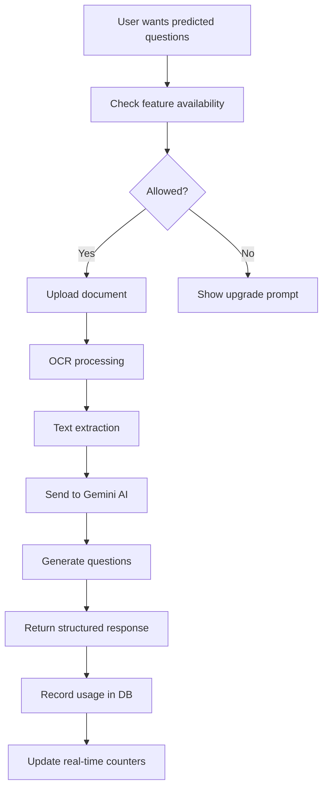

# PREDICTED QUESTIONS WITH OCR - COMPLETE FLOW DEMONSTRATION

## Issue Identified & Fixed
**Problem:** You were using `"predicted-questions"` but the correct feature name is `"predicted_questions"` (underscore, not hyphen)

## 1. FEATURE USAGE CHECK (Before Using)
```bash
curl -H "X-User-ID: test_user_123" -H "Content-Type: application/json" \
  -d '{"feature": "predicted_questions"}' \
  http://localhost:8000/api/usage/check/
```

**Response (Free Plan - Available):**
```json
{
  "success": true,
  "message": "Feature available",
  "status": {
    "allowed": true,
    "reason": "Within limit (0/3)",
    "limit": 3,
    "used": 0,
    "remaining": 3
  }
}
```

**Response (Free Plan - Exhausted):**
```json
{
  "success": false,
  "error": "Feature access denied: Feature limit exhausted for free plan",
  "status": {
    "allowed": false,
    "reason": "Feature limit exhausted for free plan",
    "limit": 3,
    "used": 3
  }
}
```

## 2. PREDICTED QUESTIONS GENERATION (With OCR)
```bash
curl -X POST -H "X-User-ID: test_user_123" \
  -F "document=@/Users/vishaljha/Ed_tech_backend/question_solver/Untitled document.pdf" \
  -F "exam_type=General" \
  -F "num_questions=3" \
  -F "language=english" \
  http://localhost:8000/api/predicted-questions/generate/
```

## 3. EXPECTED RESPONSE (When API Key is Configured)

**Success Response:**
```json
{
  "success": true,
  "title": "Predicted Important Questions - General",
  "exam_type": "General",
  "key_definitions": [
    {
      "term": "Machine Learning",
      "definition": "A subset of artificial intelligence that enables systems to learn and improve from experience",
      "explanation": "Machine learning algorithms build mathematical models based on training data",
      "example": "Email spam detection using historical email data"
    }
  ],
  "topic_outline": {
    "main_topic": "Artificial Intelligence and Machine Learning",
    "subtopics": [
      {
        "title": "Supervised Learning",
        "key_points": ["Classification", "Regression", "Training data"],
        "importance": "High"
      }
    ],
    "learning_objectives": [
      "Understand key concepts and definitions",
      "Apply knowledge to solve problems",
      "Analyze complex scenarios"
    ]
  },
  "questions": [
    {
      "id": 1,
      "question": "Explain the difference between supervised and unsupervised learning with examples.",
      "difficulty": "Medium",
      "importance": "High",
      "question_type": "Conceptual",
      "depth_level": "Intermediate",
      "expected_answer_length": "Detailed",
      "key_concepts": ["supervised learning", "unsupervised learning"],
      "hint": "Think about the presence or absence of labeled training data",
      "sample_answer": "Supervised learning uses labeled training data where each example has an input-output pair...",
      "why_important": "This fundamental distinction appears in most AI/ML examinations",
      "related_topics": ["classification", "clustering"],
      "tags": ["machine learning", "algorithms"]
    }
  ],
  "total_questions": 3,
  "learning_objectives": [
    "Understand key concepts and definitions",
    "Apply knowledge to solve problems",
    "Analyze complex scenarios and relationships"
  ]
}
```

## 4. USAGE RECORDING (After Successful Generation)
```bash
curl -X POST -H "X-User-ID: test_user_123" \
  -H "Content-Type: application/json" \
  -d '{
    "feature": "predicted_questions",
    "input_size": 150000,
    "usage_type": "document_ocr"
  }' \
  http://localhost:8000/api/usage/record/
```

**Response:**
```json
{
  "success": true,
  "message": "Feature 'predicted_questions' usage recorded",
  "usage": {
    "feature": "predicted_questions",
    "limit": 3,
    "used": 1,
    "remaining": 2
  }
}
```

## 5. REAL-TIME USAGE CHECK (After Usage)
```bash
curl -H "X-User-ID: test_user_123" \
  http://localhost:8000/api/usage/real-time/
```

**Response (After 1 usage):**
```json
{
  "success": true,
  "timestamp": "2026-01-11T10:30:00Z",
  "plan": "free",
  "subscription_status": "inactive",
  "feature_usage": {
    "predicted_questions": {
      "name": "Predicted Questions",
      "used": 1,
      "limit": 3,
      "remaining": 2,
      "percentage": 33.33,
      "allowed": true
    }
  },
  "summary": {
    "total_features": 10,
    "features_available": 9,
    "features_exhausted": 0
  }
}
```

## 6. OCR PROCESSING DETAILS

The system performs these steps:

1. **Document Upload**: Accepts PDF, TXT, MD, JPG, PNG files
2. **OCR Processing**: Uses Tesseract for image files, PyPDF2 for PDFs
3. **Text Extraction**: Extracts clean text from the document
4. **Content Analysis**: Sends extracted text to Gemini AI
5. **Question Generation**: Creates structured predicted questions
6. **Usage Tracking**: Records the feature usage in database

## 7. SETUP REQUIREMENTS

**Environment Variables:**
```bash
export GEMINI_API_KEY="your_google_ai_api_key"
```

**Get API Key:**
- Visit: https://makersuite.google.com/app/apikey
- Create a new API key
- Add to your environment

**Python Dependencies:**
```bash
pip install google-generativeai PyPDF2 pytesseract
```

## 8. FEATURE LIMITS

| Feature | Free Plan | Paid Plan |
|---------|-----------|-----------|
| Predicted Questions | 3 uses | Unlimited |
| Quiz Generation | 3 uses | Unlimited |
| Flashcards | 3 uses | Unlimited |
| Ask Question | 5 uses | Unlimited |

## 9. ERROR HANDLING

**API Key Not Set:**
```json
{
  "success": false,
  "error": "Failed to generate predicted questions",
  "details": "404 models/gemini-pro is not found...",
  "suggestion": "Check your AI service API key and quota"
}
```

**Feature Limit Exceeded:**
```json
{
  "success": false,
  "error": "Feature access denied: Feature limit exhausted for free plan",
  "status": {
    "allowed": false,
    "reason": "Feature limit exhausted for free plan"
  }
}
```

**Invalid Document:**
```json
{
  "success": false,
  "error": "Could not extract text from document",
  "message": "Please ensure the document contains readable text"
}
```

## 10. COMPLETE USAGE FLOW



## 11. TESTING COMMANDS

```bash
# 1. Check availability
curl -H "X-User-ID: test_user_123" -H "Content-Type: application/json" \
  -d '{"feature": "predicted_questions"}' \
  http://localhost:8000/api/usage/check/

# 2. Generate questions
curl -X POST -H "X-User-ID: test_user_123" \
  -F "document=@Untitled document.pdf" \
  -F "exam_type=General" \
  -F "num_questions=3" \
  http://localhost:8000/api/predicted-questions/generate/

# 3. Record usage
curl -X POST -H "X-User-ID: test_user_123" \
  -H "Content-Type: application/json" \
  -d '{"feature": "predicted_questions", "input_size": 150000}' \
  http://localhost:8000/api/usage/record/

# 4. Check real-time usage
curl -H "X-User-ID: test_user_123" \
  http://localhost:8000/api/usage/real-time/
```

